# Demo - Virtual Machine Scale Sets
This demo introduces some core concepts pertaining to Azure VM Scale Sets (VMSS). In this demonstration you will show how to
- Create a VMSS from an ARM template
- Set auto scaling of a VMSS
- Scale-up based on load
- Check the Audit Logs for autoscale events

## Prerequisites
This section lists the prerequisites required for this demonstration.
- Azure subscription

## Setup
*Estimated time: 5-10 minutes*
The setup pre-builds a VMSS to demo later. During the demo you will also demonstrate how to create a VMSS using the same process.

1. Navigate to <https://github.com/Azure/azure-quickstart-templates/tree/master/201-vmss-lapstack-autoscale>                                                                                                                                                    
2.  Scroll to the bottom of the page and click **Deploy to Azure**.

    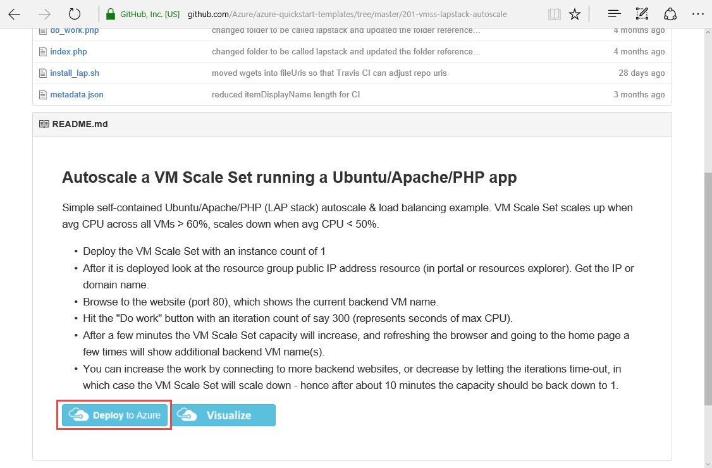

3.  Login to the portal.
4.  If not already selected, click **Edit Parameters**.

5.  Enter the following values:

    a.  (1) VMSSNAME: `<unique 9 character string>` (VMSS is registered with DNS with &lt;vmssname&gt;.&lt;region&gt;.azure.com. If the name is not unique to the region, deployment will fail. Use something like 4 letters of your alias + vmss + number.)

    b.  (2) INSTANCECOUNT: `1`

    c.  (3) ADMINUSERNAME: `<your preferred username>`

    d.  (4) ADMINPASSWORD: `<your preferred password>` 

    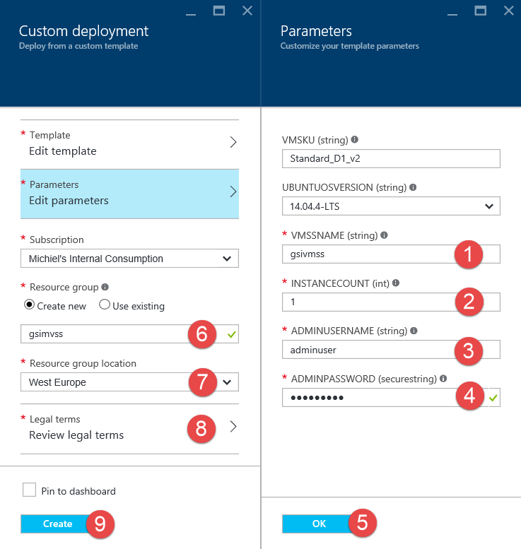                                                                                                                                                                                                   

6.  (5) Click **OK**.

7.  Make sure a new resource group is created so you can easily delete after the demo.

    a.  (6) New resource group name: `vmssdemo`

    b.  (7) Change the resource group location if needed
8.  (8) Click **Review legal terms** and click **Create**.

9.  (9) Click **Create**.

10.  Once the VMSS has been created, navigate to the resource group.

11.  Select the Public IP Address item.

12.  Copy the DNS name.

     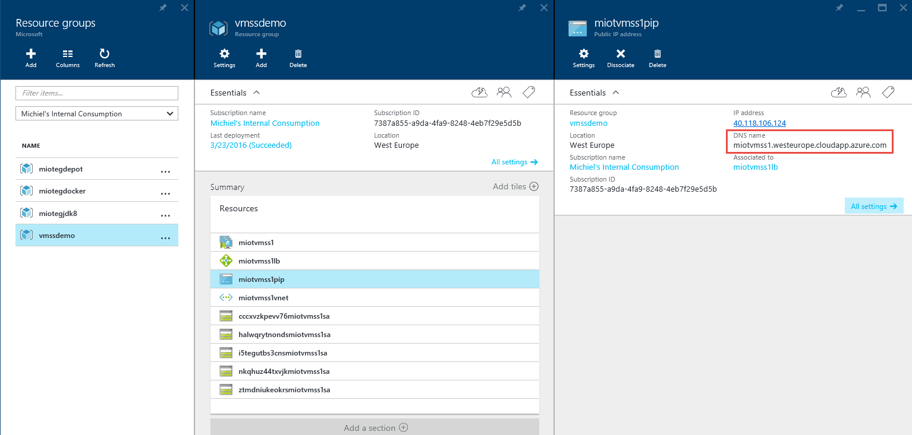

13.  Open a new browser (tab).

14.  Enter `http://` and paste the DNS name copied in step \#12.

15.  Enter `600` in the *Duration* textbox.

     
                                                                                                                                                                                                                                                                   
16.  Click **Do work**. This will create a CPU load that will lead to auto scale. The work will continue for 10 minutes, after which the cluster will downscale again. In the demo you will show the scale-up/down events.

## Demo Steps
*Estimated time: 5-10 mins*
1.  Navigate to <https://github.com/Azure/azure-quickstart-templates/>.

2.  Show that there are a lot of quick start templates that you can use.

3.  Search for vmss and show that there are several different examples. These examples show different ways to connect to VMs in a scale set, depending on your requirements. Suggest that the audience explores these.

4.  Select **201-vmss-lapstack-autoscale**.

5.  Scroll to the bottom of the page and click **Deploy to Azure**.

    

6.  Login to the portal.

7.  Click **Edit template**.                                                                                                                                                                                                                                                 

8.  Show the parameters for the template, and explain what they do.
    
    a. **vmSku**: the VM type deployed, anything between A0 and G5. Needs the exact identifier.

    b. **ubuntuOSVersion**: the OS version being deployed.

    c. **vmssName**: Unique name of the Scale Set (9 characters).

    d. **instanceCount**: Number of instances to start with.

    d. **adminUsername**: Username for the administrator to access the VMs.

    e. **adminPassword**: Password for the administrator to access the VMs. 
                                                                                                                                                                                                                                                                               
9.  Show that a limited number of storage accounts is created using a resource loop.

    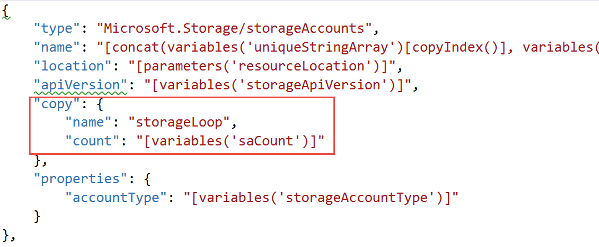

10.  Show the publicIPAddresses section, and explain that for this VMSS there is only one public IP address, which is tied to the load balancer. You can scroll further down to show the load balancer, which is directly beneath the public IP address.

     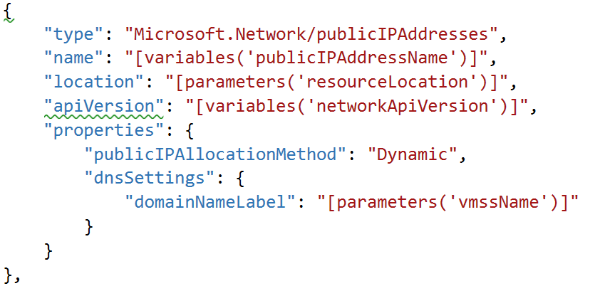

11.  Show the VMSS section. Discuss the storageloop reference to the storage accounts section showed earlier.

12.  Show the SKU, and explain that here you define the type of VM, and the number of VMs to deploy. Explain that you don’t need auto scaling if you don’t want to. You can manually scale by setting a fixed value in the **capacity** field, and the redeploy the template.

     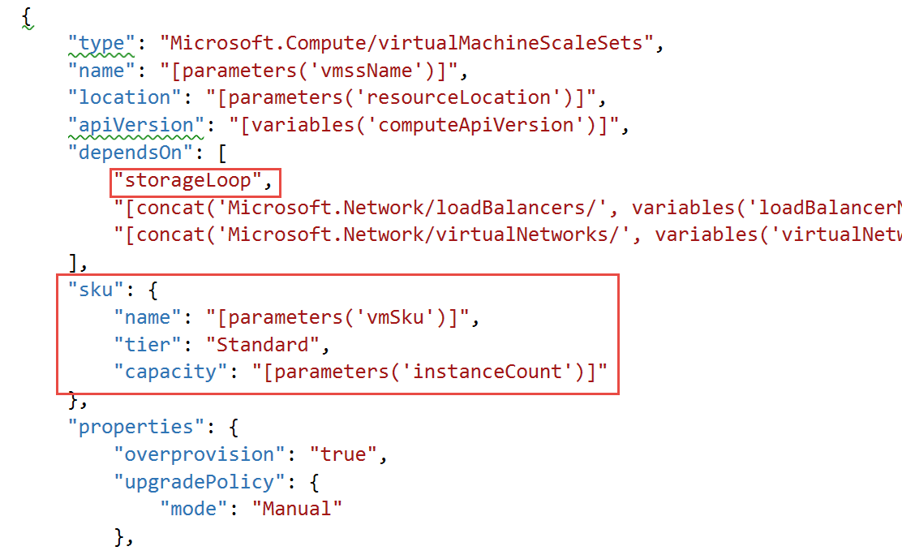

13.  Show the auto scale settings, and show the profile which defines the minimum and maximum number of VMs.

     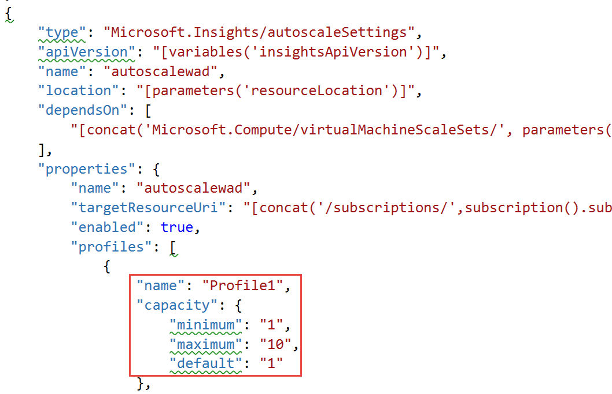

14.  Show the autoscale rules and explain what the rules do.

     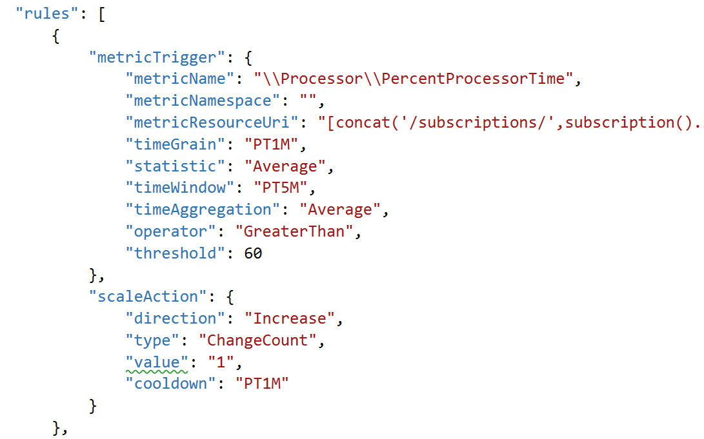

15.  Click **Edit parameters**.

16.  Explain that this is where you enter the parameter values previously discussed.

     

18.  Tell the audience you have already created a VM Scale Set based on the same template.

19.  Navigate to the resource group of the VMSS created in the setup.

20.  Note that some of the resources may have additional characters added to the same for uniqueness.

21.  Select the Public IP Address item.

22.  Show that the DNS name uses the VMSSNAME value.

23.  Copy the DNS name.

     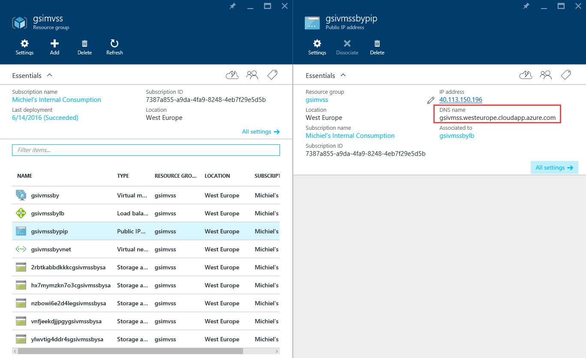

24.  Open a browser (tab).

25.  Enter `http://` and paste the DNS name copied in step \#23.

26.  Enter `600` in the *Duration* textbox.

27.  Click **Do work**. Explain that this will create a CPU load that will lead to auto scale.

    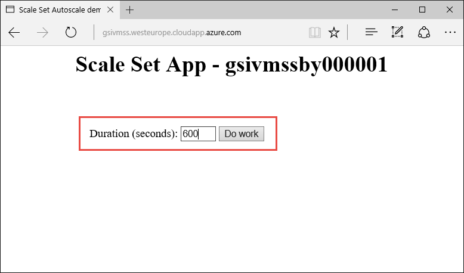

28.  Go back to the portal.

29.  Click on the scale set and note information about OS, VM type, and autoscaling.

     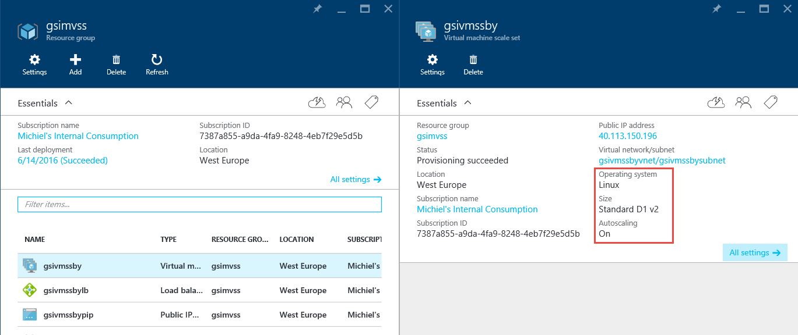

30.  Click Audit Logs.

31.  Show that earlier use of the scale set caused it to scale by showing the corresponding events in the Audit Log. Note: you can filter on autoscale operations with the Operations filter.

     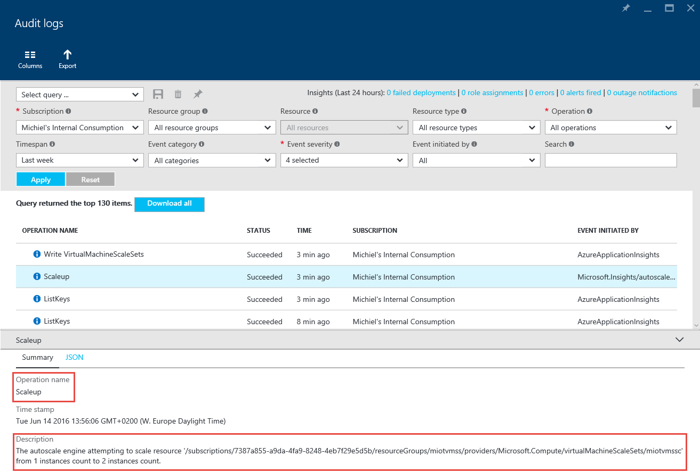

## Clean Up

To clean up this environment perform the following steps:
1.  Sign-in to the portal.
2.  Delete the delete the resource group named **vmssdemo**.