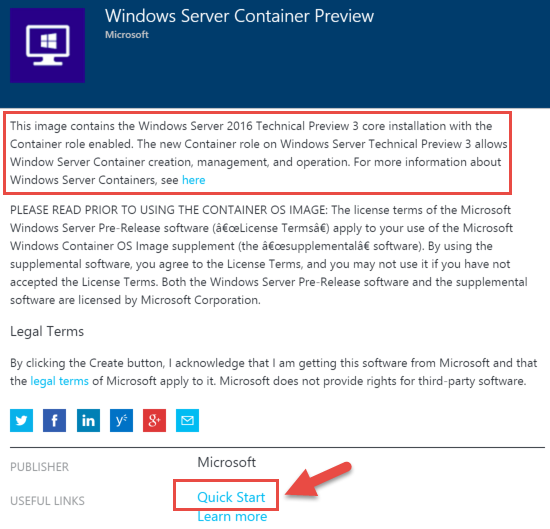

# Demo - Docker, Docker Trusted Registry, Container Apps

This demo provides an introduction to Azure’s support for Docker.
The demo covers the following:
- Docker basics and benefits.
- Creating a Docker host in Azure.
- Creating a Docker Trusted Registry in Azure. This is a feature highly requested by enterprises so that they can publish their Docker images to a private repository instead of Docker Hub which is a public repository.
- Container Apps in Azure.

## Prerequisites
This section lists the prerequisites required for this demonstration.
- Azure subscription
- SSH client (On Windows these are installed with the GitHub tools that you can install with Visual Studio.)

## Setup
*Estimated time: 15-20 minutes*

1.  Sign-in to the Azure portal.<http://portal.azure.com>                                                                  

2.  Provision a VM with pre-installed Docker e.g. ‘Docker on Ubuntu Server’ from Canonical+Microsoft

    

3.  Copy the DNS name (or IP address) from the VM configuration.

4.  Open the command prompt.

5.  Change directory to `\Program Files (x86)\Git\Bin`                                           

6.  Execute `ssh adminuser@<dns name or ip-address>`

7.  Enter the password.

8.  Execute `docker run -it centos`

9.  Let the container download and start, the type `exit`.

10.  For use with GitHub, generate a SSH-key and add it to the SSH agent. See https://help.github.com/articles/generating-a-new-ssh-key-and-adding-it-to-the-ssh-agent/.                                                           

11.  Add the SSH key to your GitHub account. See https://help.github.com/articles/adding-a-new-ssh-key-to-your-github-account/                                                                     

12.  Clone the ASP.NET Core samples.
     1.  Execute `git clone git@github.com:aspnet/Home.git aspnet-Home`                              
     2.  Execute `cd aspnet-Home/samples/HelloWeb` to check if the clone was successful.

13.	Change directory to `aspnet-Home/samples/1.0.0-rc1-update1/HelloWeb/'

14.	Build a new image: `docker build -t aspnetdemo .`

15.	Run the container to test: `docker run -t -d -p 80:5004 aspnetdemo`

16.	Open a new browser (tab) and navigate to the URL or IP address copied in step \#3. You will see ASP.NET running in the browser. (Be patient, the page needs to compile. You may have to refresh.)

17.  Execute `docker stop $(docker ps -a -q)` to stop all running containers.

18.  Execute `docker rm $(docker ps -a -q)` to delete all containers. The images are still downloaded.

## Demo Steps
This demo consists of two separate demo parts:

1. Docker basics
   - Run a single docker container and multiple instances of the same container.
   - Build a container.
   - Run a container with ASP.NET Core.

2. Docker features in the Azure portal
   - Docker Trusted Registry
   - Containers Apps

### Docker basics
*Estimated time: 10 mins*

1.	Sign-in to the Azure portal.

2.	Show that there is a VM with pre-installed Docker e.g. ‘Docker on Ubuntu Server’ from Canonical+Microsoft. Explain that this is a result of the deep partnership between Microsoft and Canonical. Explain that this is a good starting point for docker development.

     

3.	Navigate to the VM provisioned in the setup phase, and explain that you pre-provisioned a VM.

4.	Copy the DNS name (or IP address) from the VM configuration.

5.	Open the command prompt.

6.	Change directory to `\Program Files (x86)\Git\Bin`

7.	Execute `ssh adminuser@<dns name or ip-address>`

8.	Enter the password.

9.	Start a simple sample container: `docker run -it -p 80:80 tutum/hello-world`

10.	Explain that this runs the container in interactive mode, and that this ties the external VM port 80 to the container port 80.

11.	While image is downloading show that it is actually downloading multiple layers with different IDs, and that these are combined into one container image.

12.	Open a browser and navigate to the DNS name or IP-address of the server (see step \#4). This shows a browser with hello world and the container ID.

13.	On the command prompt show the incoming request. This is possible because it is running in interactive mode.

14.	Break out of the container. This exits the container (you can demonstrate by browsing to the same page, to which you now can’t connect).

15.	Run `docker ps -a` and show that the container has exited, and show that the container ID corresponds to the ID in the browser.

16.	Ask the audience how much time it would take to spin up 20 VMs.

17.	Show how quickly containers start by starting 20 containers: `for i in {1..20};do docker run -d -p 80 tutum/hello-world;done`

18.	Explain that -d means running in detached mode instead of interactive.

19.	Explain that ports are now assigned automatically, but that none is connected to port 80. You would need to add a load balancer to do that, and this is where orchestration with Swarm or Mesos would be helpful.

20.	Explain that no download is needed, because now the container image is already available.

21.	The containers should be started within a minute. Show the running containers with `docker ps`.

22.	Stop the containers: `docker stop $(docker ps -a -q)`

23.	Show that the containers have now stopped: `docker ps` should show nothing.

24. Show that the containers are still there. `docker ps -a` shows all containers with exited status.

25.	Execute `cat /etc/os-release` to show that the host OS is Ubuntu 15.10.

26.	Execute `docker run -it centos`. This should start almost immediately, because you already ran the container during setup.

27. Explain that the prompt is different, because you are now inside the container.

     

28.	Execute `cat /etc/centos-release` to show that the container is running CentOS instead of Linux. Explain that this is based a platform image, and that this means you can build layers on top of a specific Linux version, and have isolation from the OS running the container host.

28.	Type `exit`.

29.	Change directory to `aspnet-Home/samples/1.0.0-rc1-update1/HelloWeb/`

30.	Show the contents of Dockerfile: `cat Dockerfile`

31.	Explain that `FROM` indicates on which image the image to create builds.

32.	Explain that the `RUN` instruction tells docker to install all the dependencies.

33.	Explain that `EXPOSE` instruction tells docker to expose port 5004.

34.	Explain that `ENTRYPOINT` tells docker which command to run in the container when it starts, in this case the kestrel web server, which runs ASP.NET in Linux.

35.	Run the container to test: `docker run -t -d -p 80:5004 aspnetdemo`

36.	Explain that any dependencies are downloaded before the build, but because you have built already, all dependencies are already local.

37.	Open a new browser (tab) and navigate to the URL or IP address copied in step \#3. You will see ASP.NET running in the browser. (Be patient, the page needs to compile. You may have to refresh.)

### Docker features in the Azure portal
*Estimated time: 5 mins*

1.  Sign-in to the Azure portal.

2.  Navigate to **+NEW &gt; Marketplace**.

3.  In the Everything blade, type **docker** and press **ENTER**.

4.  Click on **Docker Trusted Registry**. Some things to be sure to explain here are:
                                                                                                                                                                               
    - The DTR runs on a Linux image. So, when you create a DTR you will be creating an Ubuntu virtual machine. DTR will be installed on this virtual machine.
    - The DTR provides a portal for you to manage your images and access to those images. An example screenshot of the DTR is shown here.
    - The reason you would configure a DTR is that you want a private repository to store your images in rather than a public repository such as Docker Hub. This is a common ask for enterprise customers.
                                                                                                                                                                                                                           
5.  Click **Create**.                                                                                                                                                                                                     
                                                                                                                                                                                                                           
6.  Show that the remaining steps are the same as creating a virtual machine, which you demonstrated earlier. Don’t actually go through the steps to create the VM though.

7.  Navigate to **+NEW &gt; Container Apps**.

8.  Show the container apps available on the Container Apps blade.                                                                                                                                                        

9.  Click Marketplace at the top of the Container Apps blade.

10.  Show all the apps available in the Docker Hub repository.

11.  Click on **mongo** in the Database section.

     

12. In the mongo/Docker blade show the details of what is actually deployed.

     

13. Navigate to **+NEW &gt; Compute &gt; Windows Server Container Preview**.

14. Explain that this is a Windows Server that contains the new “Container Role” introduced in Server 2016 to manage containers on a Windows host (vs a Linux host).

     

15. Click the Quick Start link to show the process to get started. Essentially pointing out that you are provisioning a new Virtual Machine that will have everything it needs to support containers.

16. Point out that everything so far has assumed you want to deploy container apps to a new virtual machine but that there is command-line support to use existing VM’s with container support also, such as PowerShell.

     

##Clean Up
To clean up delete the resource group you created.